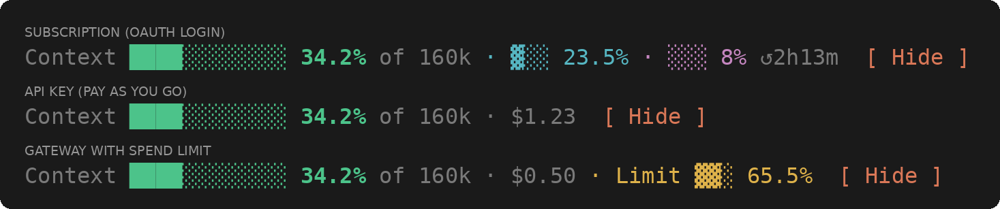

# claude-mods

[English](README.md) | [中文](README.zh-CN.md)

精选的 Claude Code marketplace，托管 **mod**——代码注册事件处理函数的 Claude Code 插件。一个仓库全部装下，按 mod 名安装。

mod 是一种 Claude Code 插件：它的 JavaScript / TypeScript 代码注册处理函数，Claude Code 在事件发生时调用它们。见[官方 mods 文档](https://code.claude.com/docs/en/plugins/mods/overview)。



下表列出本 marketplace 的全部 mod，每条都可从这里安装。

| mod | 说明 | 安装 |
| --- | --- | --- |
| [context-band](mods/context-band/README.zh-CN.md) | 输入框上方的实时带：上下文占用 + 套餐额度 / 会话花费（自适应登录方式） | `/plugin install context-band --marketplace JinhaoFang/claude-mods` |
| [block-destructive-commands](mods/block-destructive-commands/README.md) | 在执行前拦截破坏性 Bash 命令（对根目录递归 rm、强推、hard reset、破坏性 SQL、格式化磁盘） | `/plugin install block-destructive-commands --marketplace JinhaoFang/claude-mods` |
| [agent-flow](mods/agent-flow/README.md) | 输入框旁实时展示会话的子代理与队友树；无法绘制面板时以文本打印 | `/plugin install agent-flow --marketplace JinhaoFang/claude-mods` |
| [image-view](mods/image-view/README.md) | 在输入框上方显示粘贴图片的缩略图，而不是光秃秃的 `[Image #1]` 标签 | `/plugin install image-view --marketplace JinhaoFang/claude-mods` |

## 安装

mod 需要 Claude Code v2.1.287 或更高版本。一行式命令同时添加 marketplace 并安装插件：

```
/plugin install context-band --marketplace JinhaoFang/claude-mods
```

也可以先添加 marketplace，再按 mod 名安装：

```
/plugin marketplace add JinhaoFang/claude-mods
/plugin install context-band@claude-mods
```

在 Claude Code 终端会话中输入命令，按提示 `y` 确认、选择 user scope，当次会话立即生效。

## 贡献

想提交 mod，见 [CONTRIBUTING.md](CONTRIBUTING.md)。

## 许可

Apache-2.0，见 [LICENSE](LICENSE)。
